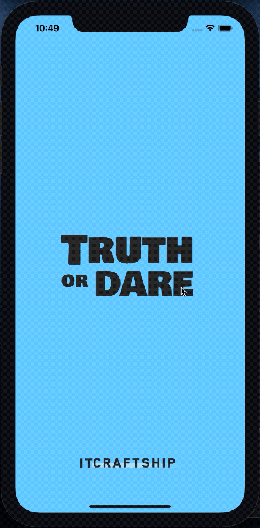

# ToD Game [](https://codemagic.io/apps/5fc783baf7698ed212bf84b9/5fc783baf7698ed212bf84b8/latest_build)

A mobile Truth or Dare game for iOS and Android application built using Flutter with CI/CD running on [Codemagic](https://codemagic.io).



<div>
  <a href='#' target='_blank'></a>
  <a href='#' target='_blank'></a>
</div>

## Quick Start

### Prerequisites

- [Install Ruby Version Manager](https://rvm.io/) – see below for details
- [Install flutter](https://flutter.dev/docs/get-started/install)
- [Install dart](https://dart.dev/)
  - MAC OS
  ```bash
  brew tap dart-lang/dart
  brew install dart
  ```

#### RVM & Ruby

##### macOS

You'll need a ruby environment. It's recommended to use [RVM](https://rvm.io).

1.  On a Mac you'll need to install GPG first, ex: https://gpgtools.org or better use ``
2.  Then install RVM by running:

```bash
gpg2 --recv-keys 409B6B1796C275462A1703113804BB82D39DC0E3 7D2BAF1CF37B13E2069D6956105BD0E739499BDB && \
curl -sSL https://get.rvm.io | bash -s stable
```

if you're getting a "no route to host" error instead run this:

```
gpg --keyserver hkp://51.38.91.189 --recv-keys 409B6B1796C275462A1703113804BB82D39DC0E3 7D2BAF1CF37B13E2069D6956105BD0E739499BDB
\curl -sSL https://get.rvm.io | bash -s stable
```

3.  If you just installed RVM, then install Ruby as well:

```
rvm install 2.4.1
```

The ruby version is specificed in `.ruby-version` file.

After you have Ruby installed using RVM, you can run:

```
bundle install
```

##### Windows

TODO: add windows instructions (contributions welcome)

# Automated Build process

## Environment setup

You need to add the following environmental variables in your `.zshrc` or `.bash_profile` (or similar for your shell):

```bash
export TOD_APPLE_ID=[your apple id]
export TOD_APP_SPECIFIC_PASSWORD=[your app specific password for CI/CD]
export TOD_MATCH_REPO=git@github.com:your-org/your-repository.git
export TOD_MATCH_PASSPHRASE=[the password to encrypt/decrypt your match repository]
```

Remember to run this after setting these variables for your current terminal instance (needed only once during setup):

```bash
source ~/.zshrc
```

## Setup iOS builds

### Create the app in AppStore Connect

Firstly create you app and bundle ID at https://developer.apple.com and use the values later on.

### Set your Apple Developer values

Replace the `com.itcraftship.truth-or-dare` bundle ID and Apple Team ID in all relevant places:

- `fastlane/Matchfile`
- `fastlane/Fastfile`
- `fastlane/Appfile`
- `ios/Runner.xcodeproj/project.pbxproj`

Change your Apple Team ID (`team_id`) in `fastlane/Appfile`.

### Create keychain

On your macOS device run:

```bash
bundle exec fastlane setup_keychain
```

This will create a new keychain to use for code signing. The password used for the keychain is `secretPass`. You don't need to worry about making it secure as it will be only on your local machine.

### Code Signing

First you need to create an SSH key for accessing your git repository with certificates for Fastlane Match to be able to clone it during the Fastlane build action. To encrypt the certificates repository you should use the value stored in `TOD_MATCH_PASSPHRASE` environment variable.

To create the certificates & provisioning profiles in your Apple Developer Account you'll need to run these 3 commands:

```bash
MATCH_PASSWORD=$TOD_MATCH_PASSPHRASE bundle exec fastlane match adhoc
MATCH_PASSWORD=$TOD_MATCH_PASSPHRASE bundle exec fastlane match development
MATCH_PASSWORD=$TOD_MATCH_PASSPHRASE bundle exec fastlane match appstore
```

When prompted for passwords/apple ID use the values that you configured in the environment above.

## Make an iOS release to TestFlight/App Store

Now you should be all set to deliver your app to TestFlight

```
sh ci/build_ios_qa.sh
```

## Setup Android builds

### Create the app in Google Play Console

Visit the [Google Play Console](https://play.google.com/console/) and create your new application. Make sure you opt-in for Google CodeSigning in Setup > App signing submenu item.

### Generate a key and keystore

1.  Use the following command to initiate keytore and certificate generation:  
    `keytool -genkey -v -keystore itc-release.keystore -keyalg RSA -keysize 2048 -validity 10000 -alias itc`
1.  Backup your `itc-release.keystore` file and store passwords safely. If you loose this, then there's a painful process that includes contacting Google's support (see: [Create a new upload key](https://support.google.com/googleplay/android-developer/answer/7384423)).

You can call the keystore whatever you like instead of `itc-release.keystore`, but you'll have to use that new name across all other placess, .i.e.:

- `android/key.properties`
- `codemagic.yaml`

#### Create a key.properties file

Create a `android/key.properties` file with the keystore file name password set in the previous step:

```
storePassword=thePasswordFromBefore
keyPassword=thePasswordFromBefore
keyAlias=itc
storeFile=../../itc-release.keystore
```

### Generate a google_play.json for upload

As Google Play account owner follow these instructions to generate the JSON key for API upload to Google Play:
https://developers.google.com/android-publisher/getting_started

Add this `google_play.json` file to the root of your project. This will allow uploading to the Google Play store.

## Make a release to Google Play

Run:

```bash
sh sh ci/build_android_qa.sh
```

## Setup the builds with Codemagic

TODO: add the link to the tutorial for the whole codemagic setup

## License

Released under MIT License. See [LICENSE](LICENSE) for more info.
