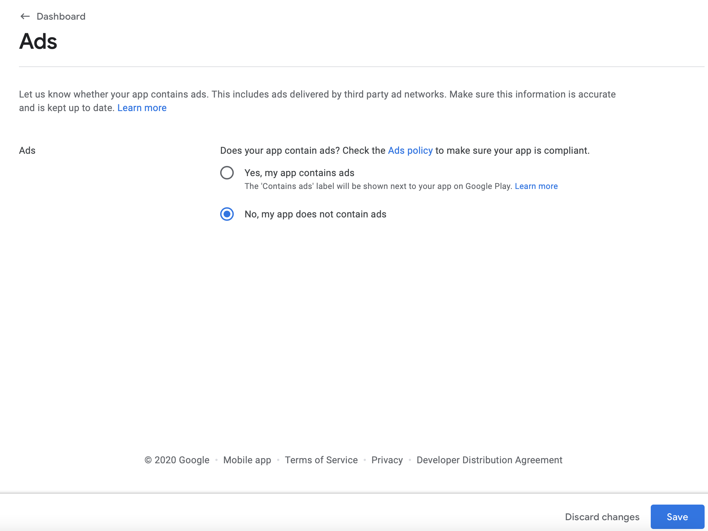
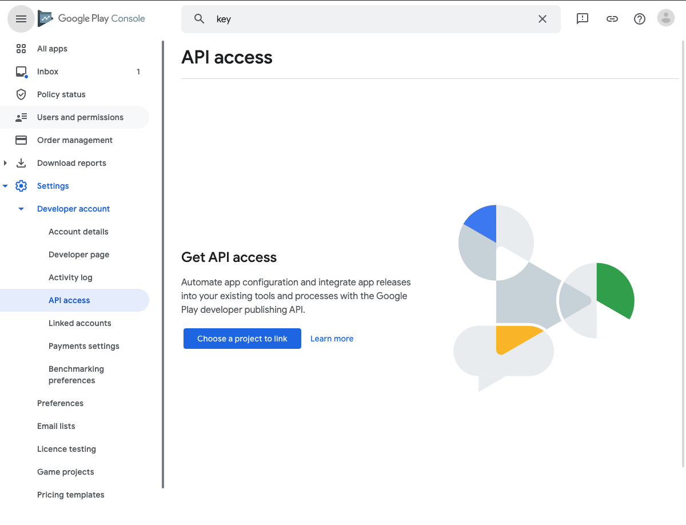

# CI/CD for Flutter is a piece of cake with Fastlane and Codemagic

Setting up test automation and CI/CD for mobile apps is something that we commonly have to do for our projects. It's a repeatable task, but for every app that we've been setting this up it took a significant time (even up to 2 days). Based on five years of experience in configuring iOS and Android builds using Fastlane for native and hybrid mobile technologies (Cordova, Capacitor, React Native and Flutter we established a tenplate that we use to jump-start CI/CD setup for new projects.

This tutorial will present a step by step guide on how to setup Codemagic CI with Fastlane and publish the ToD Game to both App Store and Google Play using your own developer accounts.
The steps will allow you to customize your app name, so modifying this for your specific application will hardly be a challenge.

Good luck releasing your apps!

## DISCLAIMERS

### Operating System

Since building apps for iOS relies on having a computer with macOS, we'll assume that this is the environment you have. If you're running on a Linux-based OS many of the steps will look the same. On Windows, however, I recommend that you use the [Windows Subsystem for Linux](https://docs.microsoft.com/en-us/windows/wsl/about) to follow this guide.

### Shell

We are assuming either `zsh` or `bash` for your default shell. If you're using something else (ex. `fish`) you will have to use appropriate syntax for some things - like setting environment variables.

Later whenever we mention that you should set an environment variable, besides of running the `export` command in your current terminal instance, make sure to add this `export` to your shell profile (ex. `.zshrc`, `.bashrc`, `.bash_profile` ).

### Flutter & Xcode version

At the time of writing this app, Flutter was at version `1.22.5` and XCode at `12.3`. Codemagic allows setting those versions in the YAML configuration, so nothing should change for your CI. However, on your local machine you may experience issues building the app if there were significant breaking changes in Flutter or XCode versions.

# Forking the repository

To copy the repository to your account, press the **Fork** button in the top right corner of the repository. After a while it should be visible as one of yours repositories.


# Preparations

## Clone the fork

First start by cloning the repository into a desired location and

## Install the prerequisites

Before you can build and run the project locally, you'll have to follow the README to install all the required dependencies. I will assume that you already know how to create a new flutter project, but here are some of the steps from our README that will help you make sure you installed everything you need:

### Prerequisites

- [Install Ruby Version Manager](https://rvm.io/) – not required, but recommended (see below for details)
- [Install flutter](https://flutter.dev/docs/get-started/install) and dependencies, including:
  - Xcode
  - Cocoapods (when you chose to use RVM, then make sure to install Cocoapods again for the current ruby environment – i.e. `Ruby 2.4.1`)
- [Install dart](https://dart.dev/)
  - MAC OS (assumes you have [Homebrew](https://brew.sh/))
  ```bash
  brew tap dart-lang/dart
  brew install dart
  ```

#### RVM & Ruby

You'll need a ruby environment. It's recommended to use [RVM](https://rvm.io).

1.  On a Mac you'll need to install GPG first, ex: https://gpgtools.org or better use ``
2.  Then install RVM by running:

```bash
gpg2 --recv-keys 409B6B1796C275462A1703113804BB82D39DC0E3 7D2BAF1CF37B13E2069D6956105BD0E739499BDB && \
curl -sSL https://get.rvm.io | bash -s stable
```

if you're getting a "no route to host" error instead run this:

```
gpg --keyserver hkp://51.38.91.189 --recv-keys 409B6B1796C275462A1703113804BB82D39DC0E3 7D2BAF1CF37B13E2069D6956105BD0E739499BDB
\curl -sSL https://get.rvm.io | bash -s stable
```

3.  If you just installed RVM, then install Ruby as well:

```
rvm install 2.4.1
```

The ruby version is specificed in `.ruby-version` file.

## Build the project

In order to build the project, first you need to run the command:

    flutter pub get

If you are using Android Studio you can also enter **pubspec.yaml** file and press the **get** button at the top right corner.

Next, use the command

    flutter run

To see if everything is working properly and the app is building.

## Fastlane

To make publishing process easier and faster, we will use Fastlane. It is already included inside of the **Gemfile**, so all you need to do is run:

    bundle install

Now you should be ready to go.

# iOS Setup

## Bundle identifier

First thing you need to do in order to publish your app to App Store is to change the **bundle identifier** to something unique.

To make it quick we will use a **find and replace all** function.

Replace all occurrences of `com.itcraftship.truth-or-dare` with the bundle identifier of your choice.

- For Android Studio You can use `⌘⇧R` on Mac and `Ctrl+Shift+R` on Windows
- For Visual Studio Code You can use `⌘⇧F` on Mac and `Ctrl+Shift+F` on Windows, then you need to click the arrow in the top left corner to enable replacing

The files that should be affected are:

    fastlane/Appfile
    fastlane/Fastfile
    fastlane/Matchfile
    ios/Runner.xcodeproj/project.pbxproj

It will also replace the value in the tutorial Markdown, but you don't need to worry about it 😉

## Team ID

Next, You need to update the Team ID inside **Appfile**. To access it, go to `https://developer.apple.com/account`, log in to your account and click **Membership** tab. Team ID should be the 3rd row from the top.


Now, go to **Appfile** and replace the **team_id** value with your own.

## Apple ID

You will also need to add your Apple ID to environment variables, to avoid typing it every time Fastlane or Match need it. Apple ID is the email address you use to log in.

    export TOD_APPLE_ID=<your apple id>

## Application specific password

For the CI to be able to upload builds to App Store Connect, you will need to generate an **Application specific password**. [Here](https://docs.fastlane.tools/best-practices/continuous-integration/#application-specific-passwords) is a tutorial on how to do that.

As before, you should add it to environment variables:

    export TOD_APP_SPECIFIC_PASSWORD=<your app specific password for CI/CD>

## Create application with Fastlane

Now we would like to create the app inside App Store Connect. In order to do that, run the following command:

    bundle exec fastlane produce --app_name <application name of your choice> --language <primary language e.g. en-US>

As an example you could call this:

    bundle exec fastlane produce --app_name "Tod Tutorial" --language en-US

after that new iOS application should be visible in App Store Connect with the Bundle ID taken from the Appfile.

When you have the app created, you should go to App Store Connect and get the Apple ID for your app from the App Information:


You should copy this Apple ID and set it in the Fastfile for the pilot action. See the code below for reference:

    pilot(
      username: APPLE_ID,
      team_id: '120815547',
      skip_submission: true,
      skip_waiting_for_build_processing: true,
      apple_id: "1546377180" # this is where you set it
    )

## Match

We want to use a tool called match which will be responsible for managing application code signing certificates and provisioning profiles. This is an amazing way to keep code signing in sync in your entire team/company. You can read more about this approach in the [Code Signing Guide](https://codesigning.guide/).

Firstly, create a private repository (e.x on GitHub) where certificates will be stored.

Secondly, add the SSH URL of the repository to environment variables:

    export TOD_MATCH_REPO=<repository url>

> NOTE: To use Match on Codemagic later on, you will need SSH access from the build machine, so the best practice is to use SSH locally as well - both for the app repository as well as for the certificates repository.

We set this environment variable because later Match will use it during code signing – see the [Matchfile](../fastlane/Matchfile).

If you want to include additional layer of security and add a password to your certificates repository (**RECOMMENDED**), you will be asked for it the first time you run Match. After it is done You should of course add it also to your environment variables:

    export TOD_MATCH_PASSPHRASE=[the password to encrypt/decrypt your match repository]

Later, when you run any match commands, you will need to switch this password to a different environment variable: `MATCH_PASSWORD` that Fastlane uses by default.
Here is an example command:

    MATCH_PASSWORD=$TOD_MATCH_PASSPHRASE bundle exec fastlane match development

By doing this Match will not ask you for the password each time.
The trick of prefixing your environment variables will come very handy when you set up your local environment to build and sign several different applications. This is why we add the `TOD_` prefix for the case of this Truth or Dare repository. Other projects may have different prefixes like `TETRIS_`, `PRO_` or whatever you decide to use as abbreviation for your project.

After you have set these environment variables, you should set up your new Keychain. This is another trick that will come handy when codesigning different projects. It's also very convenient to create your own keychain on different build servers. That way you specify your own keychain password and make unlocking and picking the right keychain easier. The password isn't really sensitive (unless you leave your computer unlocked), but you might want to move it to environment variables for added security. Having a separate keychain for your project will also help you keep it clean and don't pollute your Login keychain with codesigning certificates and profiles. To create your keychain use this command:

    bundle exec fastlane ios setup_keychain

By default the keychain will be created in:

    /Users/<username>/Library/Keychains/itcKeychain-db

In the future you may want to replace the `itc` prefix to something related to your project or company, but you might just leave it like this to keep us warm in your memory 😉

Now, to create the certificates run the following command:

    bundle exec fastlane refresh_all_profiles

> NOTE: When you have no provisioning profiles for your app, this command will create new ones for you. You will also want to use this command whenever you add a new device to your development or ad-hoc provisioning profiles. We added a helpful command in the `Fastfile` for this specific purpose: `bundle exec fastlane add_device`.

## Match SSH Key

The most secure way to connect to git repository is by using SSH keys. When you start the deploy build on Codemagic, it will try to download signing certificates and provisioning profiles using Match. When you try it for the first time however, it will give you an **unauthorized** error. This is because your certificates repository is private. In order to connect successfully, Codemagic will need to have an SSH key which it can use to connect to the repository. It is considered unsafe to share your private key with external CI tools, so we will create a new one, just for Codemagic to use.

To generate an SSH key, run:

    ssh-keygen -t ed25519

You can name the file however you want.

Be sure to **Skip** the password prompt (press enter when you are asked for it). If you set a password for your SSH key, then Codemagic will not be able to load this key when setting up the build agent. Don't worry, you will encrypt this SSH key later using the awesome environment variable encryption feature in Codemagic.

Now add the key to the account that you created a private certificates repository with: [Here](https://docs.github.com/en/free-pro-team@latest/github/authenticating-to-github/adding-a-new-ssh-key-to-your-github-account) is a GitHub guide. If you're using a different git provider than GitHub, then consult appropriate documentation to add your SSH key.

We will use that key later, during Codemagic setup.

## Setup the testers

In order to set up testers, go to `https://appstoreconnect.apple.com`, log in and go to `My Apps` section. Select the app you created and go to `TestFlight` tab. In there, select `App Store Connect Users` on the left.


Press the plus sign next to Testers and check whoever you want to test your application.

## Release the app from your local machine

Before you build your app for the first time, make sure to install all pods using:

    find . -name "Podfile" -execdir pod install \;

Now you should be all set to release the app from your local machine. Just run the following command:

    sh ci/build_ios_qa.sh

If all went according to plan, then you'll have a shiny new build uploaded to TestFlight 🚀

# Android Setup

## Keystore

In order to sign your Android application you will need to generate a **keystore** file. Run the following command:

    keytool -genkey -v -keystore <path to use for the key>/key.jks -keyalg RSA -keysize 2048 -validity 10000 -alias <key alias you choose>

After that you also need to create a **key.properties** file inside `<app dir>/android/key.properties` with the following content:

```
storePassword=<password from previous step>
keyPassword=<password from previous step>
keyAlias=<key alias from previous step>
storeFile=<location of the key store from previous step relative to android/app directory>
```

Make the keystore path somewhere inside `<app dir>/android` and update the `android/key.properties` file correctly.

Here's an example command:

    keytool -genkey -v -keystore android/app/itc-release.keystore -keyalg RSA -keysize 2048 -validity 10000 -alias tod

And the contents of the `key.properties` file:

```
storePassword=mySuperSecretP@ss
keyPassword=mySuperSecretP@ss
keyAlias=tod
storeFile=itc-release.keystore
```

> **WARNING**: Remember not to check those files into a public source control!

## Rename your app identifier for Android

First thing you need to do in order to publish your app to App Store is to change the **bundle identifier** to something unique.

To make it quick we will use a **find and replace all** function.

Replace all occurrences of `com.itcraftship.truth_or_dare` with the bundle identifier of your choice.

- For Android Studio You can use `⌘⇧R` on Mac and `Ctrl+Shift+R` on Windows
- For Visual Studio Code You can use `⌘⇧F` on Mac and `Ctrl+Shift+F` on Windows, then you need to click the arrow in the top left corner to enable replacing

The files that should be affected are:

    android/app/build.gradle
    android/app/src/debug/AndroidManifest.xml
    android/app/src/main/AndroidManifest.xml
    android/app/src/main/kotlin/com/itcraftship/truth_or_dare/MainActivity.kt
    android/app/src/profile/AndroidManifest.xml
    fastlane/Fastfile

Again this will replace the value in the tutorial Markdown.

## Create application inside Google Play

Go to `https://play.google.com/console` and select `All apps` tab. In the top right corner, press `Create app button`.


Select a free game categories and accept the declarations and click `Create app`:


Now, you need to set up your app. This is what you should see:


Click at `View tasks` and this should appear:


We will now go through each section. Go to `App access` and select the first option:


Press `Save` and go back to Dashboard. Now go to `Ads`:



Select no ads, press save and go to next section: `Content ratings`. Provide your email address and select `Game` category:


Next, start the questionaire and select `No` in every possible option:


On summary screen press `Submit` and again, go to Dashboard and select the next section: `Target audience and content`:


Select ages from 13 up, otherwise you will have to provide a privacy policy (you can do that of course if you want).

On the next screen press `No`


Go to summary, press `Save` and again go back to dashboard and next section: `News app`


Select `No`, save and go to next section: `Store settings`:


Select `Game` and `Card` category. Provide you email address and click save. The next section we need to go to is `Main store listing`:


Here, you need to provide app name and two types of descriptions. It is totally up to you. Later you need to add app icon and some screenshots. After that, press save and that should be it for the app setup. Now, go back to Dashboard and expand the second cell:


Go to `Select testers`:


Select list names you want or create one if there are none existing. Press `Save changes`.

Now we should upload a new build manually, but first we need to acquire GooglePlay.json file.

## Google Play JSON

Again, go to `https://play.google.com/console` and log in. After you entered your account, go to **Settings -> API access**



Press the `Choose a project to link` button. After that, press `Create new service account` button.


A small window should be displayed:


Go to the `Google Cloud Platform` and press the `Create service account` button once again:


At the first step provide the name and description of your choice:


Proceed to step 2 and select Editor role:


You can skip step 3 and click `Done`. Next, scroll down to the `Keys` section. Press the `Add Key` and then `Create new key` button:


Select the JSON format:


Now it should download to your machine. After that, it should be visible on the list:


Now, go back to Google Play Console and a new service account should be visible. Press `Grant access` next to it:


At the bottom switch the tab to `App permissions`:


Click `Add app` and select your truth or dare app.


On the next screen press `Next`:


And confirm sending the invitation:


Finally, this is what you should see:


## First Upload

Put the `google_play.json` file inside your project root directory.

> **WARNING**: Remember not to check in this file to a public code repository.

Now, we should be good to go and build our first .aab. Go to terminal, change directory to your project and run:

    flutter build appbundle

If everything goes right, a path to .abb should be printed.

Now, go to Google Play console, enter Dashboard and go to `Create a new release` section:


Press `Create new release`, click `Continue` in the middle of the screen and then upload an .abb you just built.


After that, press `Save`, then `Review Release` and finally `Rollout`.

##

Now you should be all set to create a local release to Google Play using fastlane.
To do this run the following command:

    BUILD_NUMBER=0 sh ci/build_android_qa.sh

The `$BUILD_NUMBER` environment variable needs to be a unique value or Google Play will reject the upload. So the next time you run this command you'll need to increment the build. Also remember, that Codemagic will set a value for this variable for each build. If you use a specific number locally locally, a build with the same number will fail on Codemagic.

# Codemagic setup

## Configuring the project

After you log in to your Codemagic account, go to `Teams` tab:


If you haven't already, create new team.


Provide team name, user limit, and billing information later on. After that you should see a similar screen:


Go to `Team integrations` and connect to the service you are using (e.x. GitHub).


After successful connection you should see a green light:


Now, go to `Shared application` and select your truth or dare repository:


Next, go to `Apps` tab. Your application should be visible there. Press the `Finish build setup` button next to it. Select `Flutter App`.


We are almost done by this point. Now, on the right side of the screen, click the `Encrypt environmental variables`. You should see something like:


Now, this part is kind of time consuming. You now need to paste every environmental variable we set up during this tutorial and copy the result to `Codemagic.yaml` file. You can enter mentioned file to see the list of all needed variables. Here is an example:

    TOD_APPLE_ID:  Encrypted(Z0FBQUFBQmYzZ2dSVkIxQzRZYXlCS2FaMXQ1bS0waFNialQwX0NfZWxIUlNYOE9kWG5heWdPRXlIZzB3ZGJOS3dFa2dtbzNiZGNScWIxZFlRVjhJZXV4MUdnNExBam9tTy1JTzVEd1hYaWY5WEk2dDBKTFVCdkk9)

Here are all the values you'll need to set for the `publish-qa` workflow:

    TOD_MATCH_REPO: Encrypted(...)
    TOD_APPLE_ID: Encrypted(...)
    TOD_APP_SPECIFIC_PASSWORD: Encrypted(...)
    TOD_MATCH_PASSPHRASE: Encrypted(...)
    ANDROID_KEYSTORE: Encrypted(...)
    MATCH_SSH_KEY: Encrypted(...)
    ANDROID_KEY_PROPERTIES: Encrypted(...)
    GOOGLE_PLAY_JSON: Encrypted(...)

After you make changes don't forget to commit and push them to your version control system.

## Bumping the version

Before you trigger a new build, make sure you bump the version in the `pubspec.yaml` file. You should increase either `major.minor.patch` version or the `-X` pre-release suffix.

## Updating the recipients for build notifications

Make sure to update the `recipients` section in the `codemagic.yaml` file to use your own email address to get notified about build success or failure.

## Running the build on Codemagic

When you're done, press `Start new build` button, on the bottom of that window press `Select workflow from codemagic.yaml`, select the branch you are using and select `publish-qa` workflow. Press `Start new build` and wait for your build to complete. If everything goes well, new builds should be uploaded to App Store Connect and GooglePlay.

## Triggering builds

The `codemagic.yaml` configuration we prepared triggers builds on two events:

1. When you make a PR to the `main` branch, the `pr` workflow will be triggered
2. When you tag a commit on the `main` branch and push it to the remote, the `publish-qa`

This is helpful when you want to have proper continuous delivery implemented for your mobile app.

# Using this for an existing Flutter app

When you setup your new app you can use this tutorial and repository README as your guide to create a similar boilerplate for your own organization. Most importantly for a new flutter project you can copy:

- `codemagic.yaml`
- the configuration under the `fastlane` directory
- the scripts under the `ci` directory and then
- `.gitignore`

then follow the tutorial and you should be set as well.

# Final words

We tried to make this tutorial into a comprehensive guide that will cut down the time you need to set up your build automation for a Flutter mobile application using Codemagic and Fastlane. When running through the steps, the whole process took us less than 2h for completely new app identifiers. We hope that it will also help you reduce same friction in your projects. If anything isn't clear or you noticed an error in this tutorial, we'll appreciate raising an issue in the repository or a PR submission.

Thanks for reading and happy building! 🛠
